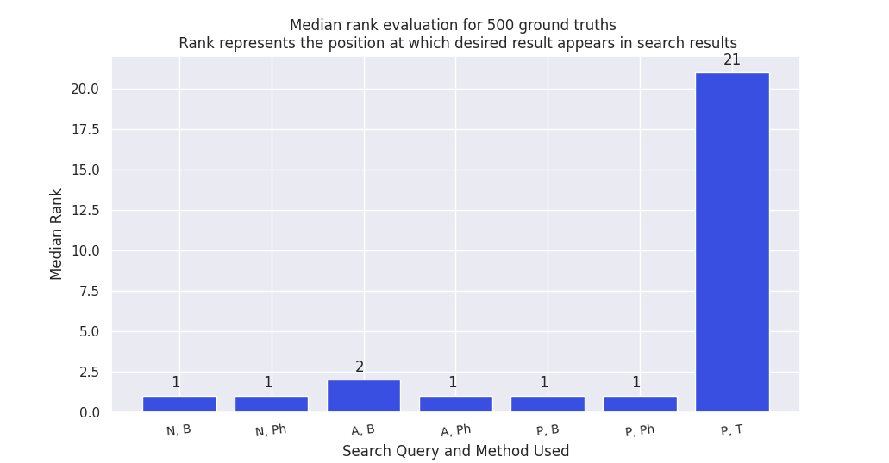
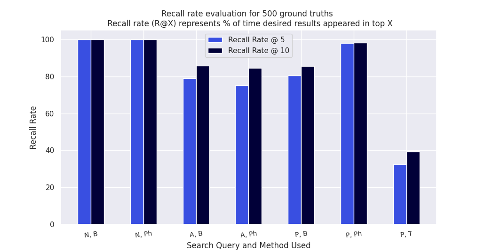
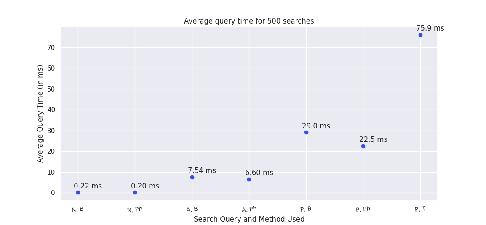

# Acad Search

The web app is live at [acadsearch.pythonanywhere.com](https://acadsearch.pythonanywhere.com). We recommend opening in Desktop.

## Table of Contents

**[Motivation](#motivation)**<br>
**[Proposal](#proposal)**<br>
**[What we have built](#what-we-have-built)**<br>
**[Working Snapshots](#working-snapshots)**<br>
**[High Level Design](#high-level-design)**<br>
**[Modules of Search Engine](#modules-of-search-engine)**<br>
**[Work Flow](#work-flow)**<br>
**[Evaluation of Search Engine](#evaluation-of-search-engine)**<br>
**[Detailed Report](#detailed-report)**<br>
**[Presentation Slides and Video](#presentation-slides-and-video)**<br>
**[Future Work](#future-work)**<br>
**[Code Directory Structure](#code-directory-structure)**<br>
**[How to Install and Run](#how-to-install-and-run)**<br>
**[References and Credits](#references-and-credits)**<br>

## Motivation

Students often find the need to search for professors based on various criteria
such as name, university, research topics, top cited papers and rank them based
on factors like citations or h-index. A simple Google search may not allow you to
first shortlist professors based on whether they do research in "adversarial machine
learning" and then rank them according to the number of citations that they have
in the last 5 years.

## Proposal

Our proposal can be accessed from [here](Proposal.pdf)

## What we have built

We have developed a search engine that can cater to the needs
of students looking for professors to approach for projects, internships or jobs.
The search engine allows users to search for professors based on name, university,
research areas and paper titles using 3 different retrieval methods. The engine also
allows users to sort the search results based on criteria like h-index, citations in the
last 5 years etc. We have deployed the search engine publicly as a web application,
and also evaluated its performance in terms of time and quality of results.

## Working Snapshots


## High Level Design


## Modules of Search Engine

### Scraping and Retrieving Text

This module uses the list of Google Scholar IDs of professors(from CSRankings, split across 10 files), scrapes data from their Google Scholar pages and stores it as CSV.

### Cleaning Data

This module cleans the scraped data from the previous module and stores it as CSV.

### Building Index

This module uses the cleaned data to build two inverted indices (first for name and affiliation, second for topics and paper titles) and stores them as JSON.

### Query Processing and Ranking

This module receives query information from the "Backend", processes it and returns an ordered list of professors depending upon the specifications provided by the user.

### Backend (Web Server)

This module forwards the user's query to the "Query Processing and Ranking" module and acts as a intermediate to user's browser.

### User

The user types a query, specifies the retrieval method(Boolean, phrase or TF-IDF) and the context in which he wants the results(names and affiliations or topics and paper titles).

### Computing Data Statistics

This module is not part of the main pipeline of the search engine. It computes and plots various statistics of the cleaned dataset. 

### Evaluation

It generates its own queries, runs the queries using "Querying and Ranking" module, evaluates search results and plots the evaluation metrics. This module is also not part of the main pipeline. 

## Work Flow


## Evaluation of Search Engine







## Detailed Report

The report can be accessed from [here](Report.pdf)

## Presentation Slides and Video

- The presentation slides can be accessed from [here (PDF)](slides.pdf) and [here (PPTX)](slides.pptx)
- The video can be accessed from [here](youtube)


## Future Work

* Scraping data from homepages of professors and universities, periodically.
* Making a directed graph using citations e.g. if a professor (in one of his papers) cites another professor's paper then it can be a directed edge. This graph can then be used to implement Pagerank.
* Improving user experience by adding search history and providing suggestions based on collaborative filtering.
* Making the default ranking metric(for Phrase and Boolean Retrieval) learn-able based on user feedback on search results.
* Evaluating the search engine with real users.

## Code Directory Structure

```
├── Proposal.pdf        
├── README.md
├── Report.pdf
├── Slides.pdf
├── cleaning
│   └── cleaning_data.py
├── data
│   ├── csrankings-0.csv
│   ├── csrankings-1.csv
│   ├── csrankings-2.csv
│   ├── csrankings-3.csv
│   ├── csrankings-4.csv
│   ├── csrankings-5.csv
│   ├── csrankings-6.csv
│   ├── csrankings-7.csv
│   ├── csrankings-8.csv
│   ├── csrankings-9.csv
│   ├── metadata.csv
│   ├── name_and_affiliation_index_full.json
│   ├── professor_data-0-cleaned.csv        
│   ├── professor_data-0.csv
│   ├── professor_data-1-cleaned.csv        
│   ├── professor_data-1.csv
│   ├── professor_data-2-cleaned.csv        
│   ├── professor_data-2.csv
│   ├── professor_data-3-cleaned.csv        
│   ├── professor_data-3.csv
│   ├── professor_data-4-cleaned.csv
│   ├── professor_data-4.csv
│   ├── professor_data-5-cleaned.csv
│   ├── professor_data-5.csv
│   ├── professor_data-6-cleaned.csv
│   ├── professor_data-6.csv
│   ├── professor_data-7-cleaned.csv
│   ├── professor_data-7.csv
│   ├── professor_data-8-cleaned.csv
│   ├── professor_data-8.csv
│   ├── professor_data-9-cleaned.csv
│   ├── professor_data-9.csv
│   ├── tf_idf_scores_topic_and_paper_full.json
│   └── topic_and_paper_index_full.json
├── data_statistics
│   ├── compute_statistics.py
│   └── plots
│       ├── 1.png
│       ├── 2.png
│       ├── 3.png
│       ├── 4.png
│       ├── 5.png
│       └── old
│           ├── 1.png
│           ├── 2.png
│           ├── 3.png
│           ├── 4.png
│           ├── 5.png
│           ├── 6.png
│           └── 7.png
├── evaluation
│   ├── average_query_time.png
│   ├── evaluate.py
│   ├── median_rank.png
│   └── recall_rate.png
├── flow-chart.png
├── helper_functions
│   └── common_functions.py
├── high-level-architecture.png
├── indexing
│   └── build_index.py
├── querying
│   ├── boolean.py
│   ├── compute_tf_idf.py
│   ├── default_rankings.py
│   └── get_tf_idf.py
├── scraping
│   └── scrape_prof_data.py
├── slides.pptx
├── snapshot-1.png
├── snapshot-2.png
└── web_server
    ├── images
    │   ├── placeholder.svg
    │   └── search.png
    ├── read_information.py
    ├── server.py
    └── templates
        └── index.html
```

## How to Install and Run

### Installation Requirements

- [Git LFS](https://git-lfs.github.com/)
- [Python](https://www.python.org/)
- [Flask](https://flask.palletsprojects.com/en/1.1.x/)
- [NLTK](https://www.nltk.org/)
- [Numpy](https://numpy.org/)
- [Pandas](https://pandas.pydata.org/)
- [Matplotlib](https://matplotlib.org/)

Then run commands ```nltk.download('punkt')``` and ```nltk.download('stopwords')``` in a Python program or iPython  if these modules are not downloaded.

***This repository contains data files inside folder ```data/``` whose size is >100 MB, such files are being tracked using Git LFS. Hence install [Git LFS](https://git-lfs.github.com/).***

### Commands to Run

Note - Run the commands for the modules in the given order since next modules uses output files from previous module. All the commands should be run inside the directory specified for each module.

#### Scrapping

```
cd scraping/
python scrape_prof_data.py
```

This module scrapes data from Google Scholar Pages by taking input from ```./data/csrankings-{x}.csv``` and outputing scraped data in ```./data/professor_data-{x}.csv```. Scraping could take too much time hence we recommend not to run these commands instead use directly use the already scraped data. ```x``` varies from 0 to 9. In the below commands ```python``` should be changed to ```python3``` if using Ubuntu/Linux.
 
#### Cleaning

```
cd cleaning/
python cleaning_data.py
```

This module cleans the scraped data by taking input from ```./data/professor_data-{x}.csv``` and outputing cleaned data in ```./data/professor_data-{x}-cleaned.csv```.

#### Building Index

```
cd indexing/
python build_index.py
```

This module takes as input the files ```./data/professor_data-{x}-cleaned.csv``` and build indices ```./data/name_and_affiliation_index_full.json``` and ```./data/topic_and_paper_index_full.json```

#### Precomputation for TF-IDF

```
cd querying/
python compute_tf_idf.py
```

This module takes as input the files ```./data/topic_and_paper_index_full.json``` and ```./data/metadata.csv``` and computes TF-IDF values for every document-term pair if it exists. It then outputs these values in file ```./data/tf_idf_scores_topic_and_paper_full.json``` which is used while querying using tf-idf retrieval method.


#### Web Server

```
cd web_server
python -m flask run
```

This module runs the web app on localhost (127.0.0.1:5000). The user can now interact with the Search Engine. With this module the main pipeline of Search Engine completes. The next two modules are used for computing statistics from the data and evaluating the Search Engine and are not part of the main pipeline.

#### Evaluation

```
cd evaluation
python evaluate.py
```

This module queries and evaluate the Search Engine using Querying module. It evaluates median rank, recall rate and average time per query. The plots ```./evaluation/average_query_time.png```, ```./evaluation/median_rank.png``` and ```./evaluation/recall_rate.png``` are generated as output.

#### Data Statistics

```
cd data_statistics
python compute_statictics.py
```

This module takes as input the data files present in ```./data``` and computes their statistics. The plots ```./data_statistics/plots/1.png```, ```./data_statistics/plots/2.png```, ```./data_statistics/plots/3.png```, ```./data_statistics/plots/4.png```, and ```./data_statistics/plots/5.png``` are generated as output.

## References and Credits

This project has been made as a part of project component of the course **CS-328: Introduction to Data Science** offered at IIT Gandhinagar in Semester-II of AY 2020-21 under the guidance of **Prof. Anirban Dasgupta**.

### References
- Berger, E. (2017). GitHub Repository. [emeryberger/CSRankings](https://github.com/emeryberger/CSrankings).
- Rajaraman, A.; Ullman, J.D. (2011). "Data Mining" (PDF). Mining of Massive Datasets. pp.
1–17.

### Contributors

- [Amey Kulkarni 18110016](https://github.com/amey-kulkarni27)
- [Chris Francis 18110041](https://github.com/frank-chris)
- [Nishikant Parmar 18110108](https://github.com/nishikantparmariam/)